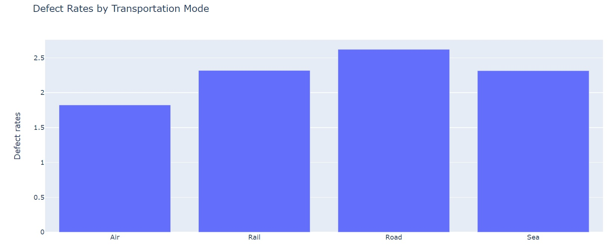

# Cosmos_Data_Portfolio
Data Science Portfolio

# [Project 1: Supply Chat Analysis](https://github.com/uzodyke/Cosmos_Data_Portfolio/blob/main/Copy_of_Supply_Chat.ipynb)

* Obtained and cleaned the dataset
* Checked for skewed data
* Filled the blank spaces with mean and mode
* Checked to oberve the correlation between other categories and the "probability" category.
* Analysed Supply Chain by looking at the relationship between categories.
* Answered business questions like
*   *Products that generated the highest revenue
*   *Average Product Lead Time
*   *Cost of Shipping
*   *Transport means that Generated Highest Grossing Revenue
*   *Cost Distibution by Carrier
*   *Average Defect rate by Product Type

*#In the above picture, The road shows a very high defect rate while air has the lowest rate

*#SUMMARY, Supply Chain Analysis is the process of examining different elements of a Supply Chain in order to identify opportunities to enhance its efficiency and generate greater value for customers. 

# [Project 2: Supply Chat Analysis](https://github.com/uzodyke/Cosmos_Data_Portfolio/blob/main/Top_Billionaire_Analysis_from_Forbes_DataSet.ipynb)

* Downloaded dataset from forbes webpage on billionaires 2021
* Cleaned and Checked for skewed data
* Removed strings that are meant to be present in the dataset
* Checked the Industry that has made the most billionairs
* Checked the country that has the most billionaires 
* The summary, the success of a business or startup is greatly influenced by the business environment of a country. Based on an analysis of global billionaires, it was found that China and the United States have the highest number of billionaires, indicating a more favorable business environment and higher success rates for startups in these countries compared to the rest of the world. I trust that enjoyed following this analysis of mine.

# [Project 3: Water Quality Analysis - Using ML to Determine Quality of Water.](https://github.com/uzodyke/Cosmos_Data_Portfolio/blob/main/water_quality_analysis.ipynb)
* We trained a machine learning model to predict the safety of drinking water with a high level of accuracy.
* The dataset was obtained from Kaggle.
* The data was cleaned of impurities using Python.
* Pycaret was deployed to give us the best classification methodology with the most optimized predictive accuracy.

